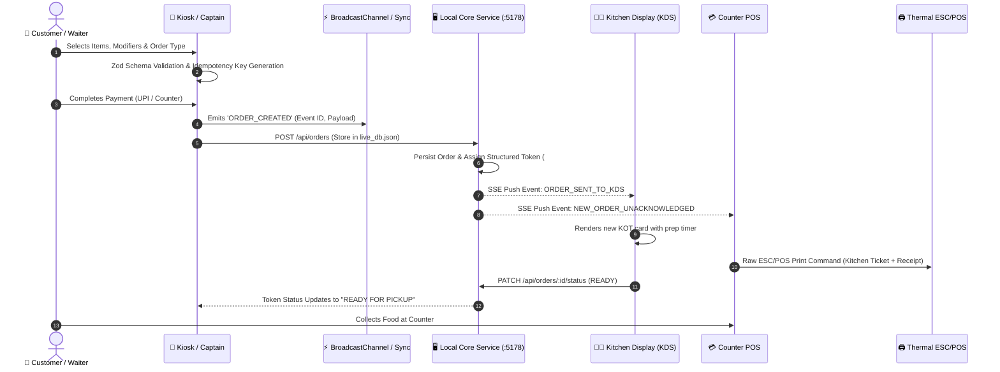

# 🍽️ JAMANVAAR Restaurant Operating System
## Complete Technical Architecture, Internal Workings & Ecosystem Report

> **Prepared for:** Engineering, Product & Operations  
> **Platform Version:** v1.0.0 Enterprise Edition  
> **Author / Maintainer:** Kelviontech  
> **Architecture Paradigm:** 100% Offline-First, Local LAN Mesh, Zero-Cloud Dependency  

---

## 📑 Executive Summary

**JAMANVAAR** is a comprehensive, production-grade restaurant operating system engineered specifically for high-throughput hospitality environments (fine dining, quick-service restaurants / QSR, cafes, food courts, and franchise outlets).

Unlike cloud-dependent SaaS solutions that stop operating when internet connectivity drops, JAMANVAAR is designed from the ground up as a **100% Offline-First Local-Area Network (LAN) System**. All transactional processing, bill generation, KOT (Kitchen Order Ticket) routing, touch-kiosk ordering, inventory depletion, and daily financial reconciliation happen locally on the restaurant premises with sub-millisecond responsiveness.

---

## 🛠️ 1. Complete Technology Stack

JAMANVAAR leverages a multi-tier, modern desktop and web engineering stack designed for ultra-low memory overhead, instant boot speeds, deterministic state persistence, and native hardware interfacing.

```
┌────────────────────────────────────────────────────────────────────────────┐
│                              FRONTEND LAYER                                │
│  React 18.3 + TypeScript 5.7 + Tailwind CSS v3 + Lucide Icons + Vite 6     │
├────────────────────────────────────────────────────────────────────────────┤
│                         CLIENT STATE & VALIDATION                          │
│      Zustand 5 (Reactive Stores) + Zod 3 (Schemas) + React Hook Form       │
├────────────────────────────────────────────────────────────────────────────┤
│                       SHARED MONOREPO CORE (SHARED/*)                      │
│ Types • Business Rules • Pricing Engine • Database • HAL API • i18n • Sync │
├────────────────────────────────────────────────────────────────────────────┤
│                     LOCAL PERSISTENCE & CACHING LAYER                      │
│     In-Memory State + LocalStorage Backing + JSON DB + SQLite Relational   │
├────────────────────────────────────────────────────────────────────────────┤
│                      INTER-PROCESS & MESH SYNC LAYER                       │
│    BroadcastChannel API + Server-Sent Events (SSE) + HTTP REST (Port 5178)  │
├────────────────────────────────────────────────────────────────────────────┤
│                         LOCAL BACKEND & SERVER CORE                        │
│         Node.js CJS Runtime (scripts/local_service.cjs / .exe)             │
├────────────────────────────────────────────────────────────────────────────┤
│                         DESKTOP PACKAGING & RUNTIME                        │
│   Tauri 2.x (Rust + WebView2) / Edge Standalone App Kiosk Mode + C# Setup  │
└────────────────────────────────────────────────────────────────────────────┘
```

### 1.1 Frontend Technologies
| Component | Technology | Role in System |
| :--- | :--- | :--- |
| **UI Framework** | **React 18.3** | Component rendering, virtual DOM reconciliation, touch interface rendering |
| **Language** | **TypeScript 5.7 (Strict Mode)** | End-to-end type safety, domain entity definitions, compile-time contract enforcement |
| **Bundler & Dev Server** | **Vite 6.1** | Sub-second HMR development, highly optimized ES bundle tree-shaking |
| **Styling & Design System** | **Tailwind CSS 3.4 + PostCSS** | Custom brand design tokens (`#0B253A` Deep Navy, `#E66817` Saffron Orange, `#FBF9F5` Ivory) |
| **State Management** | **Zustand 5.0** | Lightweight, boilerplate-free state stores with localStorage persistence & subscription selectors |
| **Form Validation** | **React Hook Form 7.54 + Zod 3.24** | Real-time validation for checkout, customer information, tax parameters, menu builder |
| **Iconography** | **Lucide React 0.475** | Vector icons for touch controls, order status badges, food diet indicators |
| **Internationalization** | **Custom i18n Engine** | Instant language switching (English, Hindi, Gujarati) with zero external network calls |

### 1.2 Shared Core & Business Layer (`/shared`)
| Package | Path | Functionality |
| :--- | :--- | :--- |
| `@jamanvaar/types` | `/shared/types` | Domain contracts: Orders, Payments, Modifiers, Combos, Shifts, Tables, Printers, Inventory |
| `@jamanvaar/database` | `/shared/database` | Repository pattern, initial seed data, relational mock schemas, live JSON DB interface |
| `@jamanvaar/business` | `/shared/business` | GST tax calculator, dynamic pricing, combo resolution, business day/EOD closing, AI assistants |
| `@jamanvaar/sync` | `/shared/sync` | LAN mesh sync engine, outbox pattern, BroadcastChannel event bus, conflict resolver |
| `@jamanvaar/api` | `/shared/api` | Hardware Abstraction Layer (HAL) for ESC/POS thermal printers, UPI dynamic QR, POS card readers |
| `@jamanvaar/ui` | `/shared/ui` | Reusable design primitives: buttons, modal dialogs, keypad, badges, data tables |
| `@jamanvaar/validation`| `/shared/validation` | Zod schemas for order creation, customer phone validation, payment idempotency |
| `@jamanvaar/utils` | `/shared/utils` | UUID generators, currency formatters (INR ₹), date-time helpers, cryptographic hashing |
| `@jamanvaar/config` | `/shared/config` | Restaurant constants, timeout thresholds, tax slab standards, port assignments |
| `@jamanvaar/i18n` | `/shared/i18n` | Localization dictionaries for English (`en`), Hindi (`hi`), and Gujarati (`gu`) |

### 1.3 Local Server & Sync Backend
- **Runtime:** Node.js CommonJS engine (`scripts/local_service.cjs` / compiled `JamanvaarLocalCore.exe`).
- **Network Port:** Default `5178` (`0.0.0.0` bound for full local restaurant subnet access).
- **Communication Protocols:**
  - **HTTP REST:** CRUD endpoints for orders, tables, menu, inventory, shifts, and printer status.
  - **Server-Sent Events (SSE):** One-way real-time push streaming to connected KDS screens, POS terminals, and Admin panels (`/api/events`).
  - **Browser BroadcastChannel:** Inter-window zero-latency event bridge (`jamanvaar_restaurant_sync_cluster_v1`) when multiple terminals run on the same physical station.

### 1.4 Native Desktop & Packaging Layer
- **Tauri 2.x:** Rust-based micro-shell paired with Windows WebView2 runtime, resulting in ~15MB RAM usage compared to 150MB+ in typical Electron apps.
- **Standalone Windows Edge App Mode:** Kiosk lockdown with restricted shell flags:
  - `--app=http://localhost:5178/<app>`
  - `--kiosk` (fullscreen auto-pinning for customer kiosks)
  - Disables devtools (F12), right-click context menu, and accidental navigation shortcuts.
- **C# Self-Extracting Windows Installers (`csc.exe`):**
  - Native `.NET` compiled setup binaries (`setup_pos.cs`, `setup_kiosk.cs`, etc.).
  - Zero external software requirement (e.g. InnoSetup/NSIS not required).
  - Automatically extracts payloads to `%LOCALAPPDATA%\Programs\JAMANVAAR\`, creates Desktop and Start Menu shortcuts, and registers with Windows "Installed Apps".

---

## 🏛️ 2. What Is Made: The Complete Suite of Applications

The repository contains **6 distinct front-end applications** organized into logical business subsystems, supported by a central local server:

```
                              JAMANVAAR ECOSYSTEM
                                       │
     ┌───────────────────┬─────────────┴──────────────┬───────────────────┐
     ▼                   ▼                            ▼                   ▼
[CUSTOMER FACING]  [COUNTER CASHIER]          [KITCHEN / PREP]    [MANAGEMENT & FLEET]
 📱 Kiosk User      💳 Counter POS              👨‍🍳 KDS Kitchen     📊 POS Admin HQ
                    🚶 Captain Table App                           ⚙️ Kiosk Admin Fleet
```

### 2.1 📱 JAMANVAAR Touch Kiosk (`apps/kiosk-system/kiosk-user`)
- **Port / Route:** Port 5174 (Dev) | `http://localhost:5178/kiosk/` (Production)
- **Target Hardware:** 21.5" to 32" vertical or horizontal commercial touchscreens.
- **Key Capabilities:**
  - **Visual Interactive Menu:** Large food imagery, category navigation, dietary filtering (Veg, Non-Veg, Vegan, Jain).
  - **Modifier & Add-on Engine:** Crust selection, extra cheese, spice level customization with dynamic price adjustments.
  - **Smart Upsell Combos:** Suggests drinks, sides, and desserts dynamically based on cart items.
  - **Multi-Payment Workflow:** Dynamic on-screen UPI QR code (PhonePe, Google Pay, Paytm), integrated card terminal trigger, or "Pay Cash at Counter" token mode.
  - **Session Isolation & Kiosk Lockdown:** Configurable inactivity countdown timer (e.g. 60 seconds) that purges cart, personal information, and active payment sessions to guarantee customer data privacy.
  - **Staff Call Assistance:** Dedicated help button notifying staff through the POS and Captain systems.

### 2.2 💳 JAMANVAAR POS (`apps/restaurant-system/pos`)
- **Port / Route:** Port 5175 (Dev) | `http://localhost:5178/pos/` (Production)
- **Target Hardware:** Cashier desktop/touch terminal, dual-display cash counter, thermal receipt printer, cash drawer.
- **Key Capabilities:**
  - **High-Speed Counter Billing:** Barcode scanning, quick item codes, rapid number pad entry, and keyboard navigation shortcuts.
  - **Dine-In Table Management:** Visual floor layout with real-time table statuses (Vacant, Seated, Bill Printed, Dirty).
  - **Order Operations:** Split billing by seat or item, bill merges, table transfers, and held order parking.
  - **Cash Drawer & Shift Management:** Cash-in / Cash-out tracking, opening drawer balance, shift handovers, and variance reports.
  - **Thermal Printing Engine:** Raw ESC/POS output via USB, Network (TCP 9100), and Bluetooth for KOT and customer receipts.
  - **Jaman AI Assistant:** Embedded conversational copilot for inventory queries, quick sales lookups, and bill discounts.

### 2.3 📊 JAMANVAAR POS Admin HQ (`apps/restaurant-system/pos-admin`)
- **Port / Route:** Port 5176 (Dev) | `http://localhost:5178/pos-admin/` (Production)
- **Target Hardware:** Manager PC, back-office laptop, tablet.
- **Key Capabilities:**
  - **Central Menu Engineering:** Master item catalog, price tiers, multi-level tax groups, and modifier configuration.
  - **Live Operations Dashboard:** Real-time revenue telemetry, hourly sales trends, active orders, and average ticket duration.
  - **Inventory & Recipe Costing:** Ingredient stock tracking, batch waste logging, and automatic stock deduction linked to menu items.
  - **Staff & Role-Based Access Control (RBAC):** Granular permission groups (Cashier, Captain, Kitchen Manager, Super Admin) with manager override PIN authorization.
  - **End of Day (EOD) & Accounting:** Business day open/close lifecycle, Z-Reports, GST tax liability reports, and ledger reconciliation.

### 2.4 ⚙️ JAMANVAAR Kiosk Admin (`apps/kiosk-system/kiosk-admin`)
- **Port / Route:** Port 5177 (Dev) | `http://localhost:5178/kiosk-admin/` (Production)
- **Target Hardware:** Central operations or franchisee kiosk management terminal.
- **Key Capabilities:**
  - **Kiosk Fleet Control:** Remote heartbeat tracking, kiosk lock/unlock commands, and device configuration updates.
  - **Kiosk-Specific Catalogs:** Enable or disable specific menu items or categories on specific kiosks.
  - **Branding & Media Manager:** Promotional banner slides, idle screensavers, and brand imagery management.
  - **Customer Feedback & Analytics:** Kiosk conversion rate metrics, average session duration, and customer satisfaction logs.

### 2.5 👨‍🍳 JAMANVAAR KDS - Kitchen Display System (`apps/restaurant-system/kds`)
- **Port / Route:** Port 5179 (Dev) | Integrated into Restaurant Hub
- **Target Hardware:** Wall-mounted 24"-43" kitchen monitors, bump-bar keyboard, or rugged touch tablets.
- **Key Capabilities:**
  - **Real-Time KOT Board:** Visual cards categorizing orders by status (`NEW`, `PREPARING`, `READY`, `SERVED`).
  - **Station Routing:** Auto-routes items to distinct prep stations (e.g. Fryer, Grill, Beverage, Dessert).
  - **Elapsed Time Indicators:** Green (on time), Yellow (approaching target time), Red (delayed prep alert).
  - **One-Touch Bump Action:** Marks items/tickets as prepared, instantly updating the POS and customer token boards.

### 2.6 🚶 JAMANVAAR Captain App (`apps/restaurant-system/captain`)
- **Port / Route:** Port 5180 (Dev) | Integrated into Restaurant Hub
- **Target Hardware:** Android tablets, rugged handheld mobile terminals carried by waitstaff.
- **Key Capabilities:**
  - **Table-Side Ordering:** Floor plan view, table reservation assignment, and instant KOT punching from tableside.
  - **Course Management:** Fire appetizers first, hold mains, and request table clearance.
  - **Service Alert Receiving:** Notified instantly when customer presses "Call Staff" on a touch kiosk or table QR code.

---

## 🔄 3. How It Works: Internal Architecture & Data Flow

### 3.1 End-to-End Order Lifecycle

The diagram below illustrates how an order placed on a Touch Kiosk or Captain App propagates through the entire restaurant ecosystem:



### 3.2 Offline-First Data Storage & Multi-Tier Persistence
Data persistence within JAMANVAAR operates on three concurrent tiers to balance **speed** and **durability**:

1. **Tier 1 - Memory Cache (`JamanvaarDatabase` singleton):**
   - Direct JavaScript memory structure for 0-millisecond read access.
   - UI views never block waiting for asynchronous database calls.
2. **Tier 2 - Browser `localStorage` Vault:**
   - Every state change triggers serialized updates to browser local storage.
   - Even if the browser tab is forcefully refreshed or closed, the exact order, shift, and table state immediately restores.
3. **Tier 3 - Local Service Disk Persistence (`live_db.json` / SQLite):**
   - Handled by `scripts/local_service.cjs`.
   - Flushes state to disk asynchronously using Write-Ahead principles.
   - Survives complete workstation power loss without corruption.

### 3.3 Conflict Resolution & Idempotency Engine
To avoid double billing and duplicate orders during intermittent network disconnections:
- **Client-Generated UUIDs (`idempotency_key`):** Every order, payment attempt, and shift event is stamped with a cryptographically unique UUID before transmission.
- **Deduplication Filter:** The server's `idempotencyMap` rejects identical requests within a 24-hour rolling window, returning the existing recorded response.
- **Hierarchical Authority Model:**
  - **Menu & Price Changes:** POS Admin is authoritative.
  - **KOT Prep Status:** Kitchen Display (KDS) is authoritative.
  - **Payment Status:** Payment gateway transaction callback or Cashier PIN confirmation is authoritative.

### 3.4 Hardware Abstraction Layer (HAL)
Located in `/packages/api/src/printer.ts` and `/packages/api/src/payment.ts`:
- **Receipt & KOT Printers:**
  - Direct ESC/POS bytecode generation (raster bit-image logo printing, text bolding, double-height headers, 80mm/58mm column alignment, cutter commands).
  - Multi-transport support: Direct USB, Raw TCP/IP Socket (`9100`), or Windows Spooler API.
- **Dynamic Payment QR:**
  - Compliant with NPCI Bharat QR / UPI specifications.
  - Formats payload: `upi://pay?pa=merchant@bank&pn=JAMANVAAR&am=450.00&tr=JV-20260905-108`.
  - Automatically verifies incoming payment webhooks via the local service bridge.

---

## 📁 4. Comprehensive Folder & Repository Breakdown

> **Accuracy note (post-migration):** This section is a point-in-time snapshot and predates the monorepo cleanup documented in [`monorepo-structure.md`](../architecture/monorepo-structure.md). `apps/kitchen-system/` and `apps/service-system/` (dead, asset-only shells) have been removed; `shared/` has been renamed to `packages/`; `scripts/` has been split into `tooling/{installers,packaging,local-runtime,dev}/`. The tree below is left as originally generated except for these two renames, for historical reference.

```
c:\Users\OM Sanjhira\OneDrive\Desktop\k2\
├── .git/                                # Git version control repository
├── apps/                                # Monorepo Applications
│   ├── kiosk-system/                    # Kiosk applications subsystem
│   │   ├── kiosk-admin/                 # Kiosk fleet control panel (React + Vite)
│   │   ├── kiosk-user/                  # Customer touch-ordering terminal (React + Vite)
│   │   └── shared/                      # Kiosk-specific shared components
│   └── restaurant-system/               # Core restaurant management applications
│       ├── pos/                         # Cashier counter billing terminal
│       ├── pos-admin/                   # Manager back-office, reports & inventory HQ
│       ├── kds/                         # Kitchen Display System
│       └── captain/                     # Waiter handheld order terminal
│
├── packages/                            # Universal Shared Monorepo Packages (was shared/)
│   ├── api/                             # Hardware Abstraction Layer (Printers, Payments, Health)
│   ├── assets/                          # Core brand logos, vector emblems, meal icons
│   ├── business/                        # Domain logic: GST calculation, Day/EOD service, AI copilot
│   ├── config/                          # App configurations, timeouts, tax rules, ports
│   ├── database/                        # Database singleton, repositories, seed engine, live_db.json
│   ├── i18n/                            # Localization engines for English, Hindi, and Gujarati
│   ├── sync/                            # LAN mesh sync, BroadcastChannel, outbox queue
│   ├── types/                           # Complete TypeScript interfaces, enums, DTOs
│   ├── ui/                              # Prebuilt design system components (buttons, modals, tables)
│   ├── utils/                           # Formatters, currency conversion, cryptography, UUIDs
│   └── validation/                      # Zod validation schemas
│
├── tooling/                             # DevOps, Packaging & Server Automation Scripts (was scripts/)
│   ├── local_service.cjs                # Offline HTTP/SSE local server (Port 5178)
│   ├── sync_server.cjs                  # Entry point loader for local_service
│   ├── JamanvaarLocalCore.exe           # Standalone compiled executable of local service
│   ├── build_windows_installers.cjs     # C# Roslyn builder generating Setup.exe installers
│   ├── package_core_menu_images.mjs     # Menu asset packaging and optimization
│   ├── download_real_food_images.mjs    # High-resolution food photography pipeline
│   ├── build_production_suite_v2.cjs    # Production builder for all web frontends
│   └── setup_bulletproof_shortcuts.ps1  # Windows desktop shortcut and icon cache scripts
│
├── release/                             # Final Distributable Windows Setup Executables
│   ├── JAMANVAAR-POS-Setup.exe          # Standalone 1-click installer for Counter POS
│   ├── JAMANVAAR-POS-Admin-Setup.exe    # Standalone 1-click installer for Admin HQ
│   ├── JAMANVAAR-Kiosk-Setup.exe        # Standalone 1-click installer for Touch Kiosk
│   ├── JAMANVAAR-Kiosk-Admin-Setup.exe  # Standalone 1-click installer for Kiosk Fleet Admin
│   ├── JAMANVAAR-Windows-Apps-v1.0.0.zip# Consolidated release package for dealers
│   └── setup_*.cs                       # Native C# source files for each installer
│
├── JAMANVAAR_DESKTOP_PACKAGE/           # Portable, Zero-Install Local Deployment Suite
│   ├── START_ALL_TERMINALS_HUB.bat      # Launches central restaurant gateway
│   ├── START_POS.bat / .vbs             # Silent background launcher for POS
│   ├── START_KIOSK.bat / .vbs           # Fullscreen lockdown launcher for Kiosk
│   ├── launcher.cjs                     # Desktop process supervisor
│   └── server/                          # Embedded Node.js runtime and assets
│
├── docs/                                # Technical Documentation & Compliance Manuals
│   ├── ARCHITECTURE.md                  # High-level architecture summary
│   ├── API.md                           # REST & SSE endpoint contracts
│   ├── DATABASE.md                      # Database schema and repository documentation
│   ├── RECEIPT_PRINTER_IMPLEMENTATION.md# ESC/POS printer implementation details
│   ├── SECURITY.md                      # Kiosk security and sandbox policies
│   └── SYNC.md                          # Data replication and sync specifications
│
├── package.json                         # Root monorepo configuration with npm workspaces
├── tsconfig.json                        # Root TypeScript configuration project references
└── vitest.config.ts                     # Unit and integration test runner configuration
```

---

## 🌐 5. How Everything Connects (Network & Process Topology)

In a live restaurant deployment, the applications run across multiple physical machines on the local network (Wi-Fi or Ethernet switch):

```
                        RESTAURANT LOCAL AREA NETWORK (LAN)
                   ════════════════════════════════════════════
                                        ║
               ┌────────────────────────╨────────────────────────┐
               │         CENTRAL SERVER STATION (POS-01)         │
               │  Runs JamanvaarLocalCore.exe / Node.js (:5178)  │
               │  Holds live_db.json + Realtime SSE Broadcaster  │
               └────────────────────────┬────────────────────────┘
                                        │
      ┌──────────────────┬──────────────┴─────┬──────────────────┐
      ▼                  ▼                    ▼                  ▼
┌──────────────┐   ┌──────────────┐   ┌──────────────┐   ┌──────────────┐
│ TOUCH KIOSK  │   │ KITCHEN KDS  │   │ WAITER TABLET│   │ MANAGER PC   │
│ IP: .101     │   │ IP: .105     │   │ IP: .108     │   │ IP: .110     │
│ Edge Kiosk   │   │ Chrome/Edge  │   │ Android/iPad │   │ Chrome/Edge  │
│ Mode Screen  │   │ Wall Monitor │   │ Captain App  │   │ Admin HQ     │
└──────────────┘   └──────────────┘   └──────────────┘   └──────────────┘
```

### Network Topology & Port Map:
| Service / Application | Dev Port | Prod Port / URL | Protocol | Role |
| :--- | :--- | :--- | :--- | :--- |
| **Local Service Core** | `5178` | `http://<SERVER_IP>:5178` | HTTP / SSE | Central database, sync broker & asset server |
| **Terminal Hub** | `5178` | `http://<SERVER_IP>:5178/` | HTTP | Landing page to select and open any terminal |
| **JAMANVAAR POS** | `5175` | `http://<SERVER_IP>:5178/pos/` | HTTP / WS | Cashier counter billing |
| **JAMANVAAR POS Admin**| `5176` | `http://<SERVER_IP>:5178/pos-admin/` | HTTP | Back-office and KDS management |
| **JAMANVAAR Kiosk** | `5174` | `http://<SERVER_IP>:5178/kiosk/` | HTTP | Customer touchscreen self-ordering |
| **JAMANVAAR Kiosk Admin**| `5177` | `http://<SERVER_IP>:5178/kiosk-admin/`| HTTP | Kiosk fleet controller |
| **Thermal Printer** | - | Port `9100` (Raw) | TCP Socket | ESC/POS receipt and KOT ticket printing |

---

## ⚡ 6. How to Run, Develop & Build

### 6.1 Running in Development Mode
To run all applications concurrently with instant Hot Module Replacement:
```bash
# 1. Install root and workspace dependencies
npm install

# 2. Start the local sync server and all frontends simultaneously
npm run dev
```
This boots:
- Local Core Service on `http://localhost:5178`
- Kiosk User on `http://localhost:5174`
- POS Terminal on `http://localhost:5175`
- POS Admin on `http://localhost:5176`
- Kiosk Admin on `http://localhost:5177`
- Captain App on `http://localhost:5180`
- KDS System on `http://localhost:5179`

### 6.2 Running Production Standalone on Windows
No Node.js or terminal needed for end-users:
1. Navigate to `c:\Users\OM Sanjhira\OneDrive\Desktop\k2\release\`.
2. Double-click any of the setup installers (e.g. `JAMANVAAR-POS-Setup.exe`).
3. Launch directly from the newly created Desktop Shortcut!

Alternatively, for on-premise multi-terminal deployments without installation:
1. Open `JAMANVAAR_DESKTOP_PACKAGE`.
2. Double-click `START_ALL_TERMINALS_HUB.bat`.
3. Access all apps through the unified terminal dashboard at `http://localhost:5178`.

### 6.3 Building Production Packages From Source
```bash
# Prepare and optimize food imagery
npm run prepare:images

# Build all production web bundles
npm run build

# Generate Windows Setup.exe executables using native C# compiler
node scripts/build_windows_installers.cjs
```

---

## 🏆 7. Key Enterprise Differentiators
1. **Zero Internet Dependency:** The restaurant never loses revenue due to internet outages or external cloud downtime.
2. **Sub-Millisecond Speed:** Client-side in-memory caching provides instant search, touch responsiveness, and receipt generation.
3. **Hardware Freedom:** Works with standard Windows PCs, any ESC/POS thermal printer, Android tablets, and commercial touchscreens.
4. **Idempotent Fault-Tolerant Sync:** Offline outbox queues guarantee zero lost or duplicated orders even if terminals disconnect mid-shift.
5. **Turnkey Windows Distribution:** Custom C# compiled standalone `.exe` installers make deployment as simple as double-clicking an installer.
